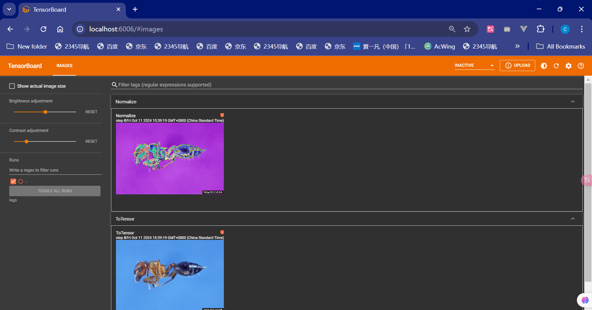

## Python中的两大法宝


我们把pytorch看成百宝箱假如里面有4个区域分别为1，2，3，4

3里面又有a，b，c

### dir()：打开，看见

能让我们知道工具箱以及工具箱中的分隔区有什么东西

- dir(pytorch)
  - 输出：1，2，3，4

- dir(pytorch.3)
  - 输出：a，b，c

### help()：说明书

可以让我们知道每个工具是如何使用的，工具的使用方法

- help(pytorch.3.a)
  - 输出：将此扳手放在特定地方，然后拧动


## 三种运行场景


## Pytorch加载数据初认识

- Dataset：提供一种方式去获取数据及其label
  - 如何获取每一个数据以及其label
  - 告诉我们总共有多少个数据
- Dataloader
  - 为网络提供不同的数据形式

## Dataset类代码实战

1. 使用的数据集是**hymenoptera_data**


具体代码详见： [read_data.py](Project1\read_data.py) 

```py
from torch.utils.data import Dataset
from PIL import Image
import os
class Mydata(Dataset):
    # 主要提供全局变量
    def __init__(self,root_dir,label_dir):
        self.root_dir = root_dir
        self.label_dir = label_dir
        self.path = os.path.join(self.root_dir,self.label_dir)
        self.img_path = os.listdir(self.path)

    def __getitem__(self, index):
        img_name = self.img_path[index]
        img_item_path = os.path.join(self.path,img_name)
        img = Image.open(img_item_path)
        label = self.label_dir
        return img, label
    def __len__(self):
        return len(self.img_path)


if __name__ == '__main__':
    root_dir = "hymenoptera_data/hymenoptera_data/train"
    ants_dir = "ants"
    bees_dir = "bees"
    ants_dataset = Mydata(root_dir,ants_dir)
    bees_dataset = Mydata(root_dir,bees_dir)
    
    train_dataset = ants_dataset + bees_dataset
```

2. 使用的数据集是**hymenoptera_data_practice**（这个是练手的项目）

   需要注意的是label文件的提取

   ```python
   with open(label_item_path, 'r') as f:
       label = f.readline()
   ```

具体代码详见： [read_data_practice.py](Project1\read_data_practice.py) 

```python
from torch.utils.data import Dataset, DataLoader
import numpy as np
from PIL import Image
import os
from torchvision import transforms

class MyData(Dataset):

    def __init__(self, root_dir, image_dir, label_dir, transform):
        self.root_dir = root_dir
        self.image_dir = image_dir
        self.label_dir = label_dir
        self.label_path = os.path.join(self.root_dir, self.label_dir)
        self.image_path = os.path.join(self.root_dir, self.image_dir)
        self.image_list = os.listdir(self.image_path)
        self.label_list = os.listdir(self.label_path)
        self.transform = transform
        # 因为label 和 Image文件名相同，进行一样的排序，可以保证取出的数据和label是一一对应的
        self.image_list.sort()
        self.label_list.sort()

    def __getitem__(self, idx):
        img_name = self.image_list[idx]
        label_name = self.label_list[idx]
        img_item_path = os.path.join(self.root_dir, self.image_dir, img_name)
        label_item_path = os.path.join(self.root_dir, self.label_dir, label_name)
        img = Image.open(img_item_path)

        with open(label_item_path, 'r') as f:
            label = f.readline()

        # img = np.array(img)
        img = self.transform(img)
        sample = {'img': img, 'label': label}
        return sample

    def __len__(self):
        assert len(self.image_list) == len(self.label_list)
        return len(self.image_list)

if __name__ == '__main__':
    transform = transforms.Compose([transforms.Resize((256, 256)), transforms.ToTensor()])
    root_dir = "hymenoptera_data_practice/train"
    image_ants = "ants_image"
    label_ants = "ants_label"
    ants_dataset = MyData(root_dir, image_ants, label_ants, transform)
    image_bees = "bees_image"
    label_bees = "bees_label"
    bees_dataset = MyData(root_dir, image_bees, label_bees, transform)
    train_dataset = ants_dataset + bees_dataset

```

## Tensorboard

 [test_tb.py](Project1\test_tb.py) 

```python
from torch.utils.tensorboard import SummaryWriter
writer = SummaryWriter('logs')


# y = 2x
for i in range(100):
    writer.add_scalar('y=2x', 2*i, i)

writer.close()
```


关于tensorboard视图：https://blog.csdn.net/qq_39333636/article/details/125348047

### add_image()

```python
def add_image(self, tag, img_tensor, global_step=None, walltime=None, dataformats='CHW')
Args:
            tag (string): Data identifier
            img_tensor (torch.Tensor, numpy.array, or string/blobname): Image data
            global_step (int): Global step value to record
            walltime (float): Optional override default walltime (time.time())
              seconds after epoch of event
Shape:
            img_tensor: Default is :math:`(3, H, W)`. You can use ``torchvision.utils.make_grid()`` to
            convert a batch of tensor into 3xHxW format or call ``add_images`` and let us do the job.
            Tensor with :math:`(1, H, W)`, :math:`(H, W)`, :math:`(H, W, 3)` is also suitable as long as
            corresponding ``dataformats`` argument is passed, e.g. ``CHW``, ``HWC``, ``HW``.
```

这里的img_tensor需要是**torch.Tensor, numpy.array, or string/blobname**这三种类型


但我们的类型是JPEG的所以之后我们需要做下转换

### 转换成 numpy.array

```python
img_array = np.array(img)
print(img_array)
print(type(img_array))
```

这段代码就可以从<class 'PIL.JpegImagePlugin.JpegImageFile'>直接转换成<class 'numpy.ndarray'>

```py
image_path = "hymenoptera_data_practice/train/ants_image/0013035.jpg"
img_RIL = Image.open(image_path)
img_array = np.array(img_RIL)
print(img_array.shape)
```

发现这个结果(512, 768, 3)和我们add_image()中的shape()不一样所以我们在后面需要加上`dataformats='HWC'`

```python
from torch.utils.tensorboard import SummaryWriter
import numpy as np
from PIL import Image

writer = SummaryWriter('logs')

image_path = "hymenoptera_data_practice/train/ants_image/0013035.jpg"
img_RIL = Image.open(image_path)
img_array = np.array(img_RIL)
print(img_array.shape)

writer.add_image("test",img_array,1,dataformats='HWC')
```


## Transform 

 [Transform_practice.py](Project1\Transform_practice.py) 

structure的快捷键是`Alt+7`


transform.py ->工具箱

ToTensor这个工具把`pic (PIL Image or numpy.ndarray)`这些数据类型转换为`Tensor`

之后`transforms.ToTensor()`创建一个具体的工具


### Transform如何使用（python）

#### 针对PIL类型

```python
from PIL import Image
from torchvision import transforms

# 绝对路径 G:\学术\pytorch\Project1\hymenoptera_data_practice\train\ants_image\0013035.jpg
# 相对路径 hymenoptera_data_practice/train/ants_image/0013035.jpg
img_path = "hymenoptera_data_practice/train/ants_image/0013035.jpg"
img = Image.open(img_path)
# print(img)

tensor_trans = transforms.ToTensor()
tensor_img = tensor_trans(img)

print(tensor_img)
```

#### 针对narray类型

```python
import cv2
cv_img = cv2.imread(img_path)# 这里是narray类型
# 之后的操作同上
tensor_trans = transforms.ToTensor()
tensor_img = tensor_trans(img)
```

### 为什么我们需要Tensor数据类型


tensor有很多方法如上图


有很多属性如上图

```python
from PIL import Image
from torch.utils.tensorboard import SummaryWriter
from torchvision import transforms

# python的用法 -》 tensor数据类型
# 通过 transfrom.ToTenser去解决两个问题

# 2、为什么我们需要Tensor数据类型

# 绝对路径 G:\学术\pytorch\Project1\hymenoptera_data_practice\train\ants_image\0013035.jpg
# 相对路径 hymenoptera_data_practice/train/ants_image/0013035.jpg
img_path = "hymenoptera_data_practice/train/ants_image/0013035.jpg"
img = Image.open(img_path)
# print(img)

writer  = SummaryWriter('logs')

# 1、transform如何使用（python）
tensor_trans = transforms.ToTensor()
tensor_img = tensor_trans(img)
# print(tensor_img)

writer.add_image("Tensor Image", tensor_img)

writer.close()
```


## 常见的Transform

 [UsefulTransform.py](Project1\UsefulTransform.py) 

### 基础知识

 [CallTest.py](Project1\test\CallTest.py) 

```python
class Person:
    def __call__(self, name):
        print("__call__"+"Hello"+name)

    def hello(self,name):
        print("Hello"+name)

person = Person()
person("zhangsan")
# __call__Hellozhangsan

person.hello("zhangsan")
# Hellozhangsan
```

关于call方法：[Python __call__()方法（详解版） (biancheng.net)](https://c.biancheng.net/view/2380.html)

### ToTensor

```python
# ToTensor
trans_totensor = transforms.ToTensor()
img_tensor = trans_totensor(img)
writer.add_image('ToTensor', img_tensor)
```

### Normalize 

**归一化**

```python
class Normalize(torch.nn.Module):
    """Normalize a tensor image with mean and standard deviation.
    This transform does not support PIL Image.
    Given mean: ``(mean[1],...,mean[n])`` and std: ``(std[1],..,std[n])`` for ``n``
    channels, this transform will normalize each channel of the input
    ``torch.*Tensor`` i.e.,
    ``output[channel] = (input[channel] - mean[channel]) / std[channel]``
```

**output[channel] = (input[channel] - mean[channel]) / std[channel]**

```
trans_norm = transforms.Normalize([0.5, 0.5, 0.5],[0.5, 0.5, 0.5])
```

> (input - 0.5) / 0.5 = 2 * input - 1
>
> input[0,1]
>
> output[-1,1]

```py
# Normalize
print(img_tensor[0][0][0])
trans_norm = transforms.Normalize([0.5, 0.5, 0.5],[0.5, 0.5, 0.5])
img_norm = trans_norm(img_tensor)
print(img_norm[0][0][0])
writer.add_image('Normalize', img_norm)
```

归一化之后如下图



### Resize

```python
#Resize
print(img.size)
trans_resize = transforms.Resize((512,512))
# img PIL -> resize ->img_resize PIL
img_resize = trans_resize(img)
# img_resize PIL -> totensor ->img_resize tensor
img_resize = trans_totensor(img_resize)
writer.add_image('Resize', img_resize)
print(img_resize)
```


可以看到尺寸**有变化**了

### Compose

等比放大

```py
class Compose:
    """Composes several transforms together. This transform does not support torchscript.
    Please, see the note below.

    Args:
        transforms (list of ``Transform`` objects): list of transforms to compose.

    Example:
        >>> transforms.Compose([
        >>>     transforms.CenterCrop(10),
        >>>     transforms.PILToTensor(),
        >>>     transforms.ConvertImageDtype(torch.float),
        >>> ])
```


```python
# Compose - resize -2
trans_resize_2 = transforms.Resize(512)
trans_compose = transforms.Compose([trans_resize_2, trans_totensor])
img_resize_2 = trans_compose(img)
writer.add_image('Resize', img_resize_2,2)
```

这里类似一个组合输出的形式

```python
# PIL -> PIL -> tensor 
trans_compose = transforms.Compose([trans_resize_2, trans_totensor])
```

列表里面放的都是方法，前一个输出会当成后一个的输入，一步到位

### RandomCrop

随机裁剪

```python
# RandomCrop
trans_random = transforms.RandomCrop((300,500))
trans_compose2 = transforms.Compose([trans_random, trans_totensor])
for i in range(10):
    img_crop = trans_compose2(img)
    writer.add_image('RandomCrop', img_crop,i)
```


## Torchvision中数据集使用

一些数据集：[torchvision.datasets — PyTorch master documentation](https://pytorch.org/docs/1.0.0/torchvision/datasets.html)

手写文字数据集：[MNIST handwritten digit database, Yann LeCun, Corinna Cortes and Chris Burges](https://yann.lecun.com/exdb/mnist/)

物体识别数据集：[CIFAR-10 and CIFAR-100 datasets (toronto.edu)](https://www.cs.toronto.edu/~kriz/cifar.html)

### CIFAR数据集的使用

 [dataset_transform.py](Project1\dataset_transform.py) 

[torchvision.datasets — PyTorch master documentation](https://pytorch.org/docs/1.0.0/torchvision/datasets.html#cifar)


```python
import torchvision
from torch.utils.tensorboard import SummaryWriter

dataset_transform = torchvision.transforms.Compose([
    torchvision.transforms.ToTensor()
])

train_set = torchvision.datasets.CIFAR10(root='./dataset', train=True, transform=dataset_transform, download=True)
test_set = torchvision.datasets.CIFAR10(root='./dataset', train=False, transform=dataset_transform, download=True)

# print(test_set[0])
# print(test_set.classes)
#
# img,target = test_set[0]
# print(img)
# print(target)
# print(test_set.classes[target])
# img.show()

# print(test_set[0])

writer = SummaryWriter("p10")
for i in range(10):
    img, target = test_set[i]
    writer.add_image("test_set", img, i)

writer.close()
```


## DataLoader

 [data_loader.py](Project1\data_loader.py) 

数据加载器，每次从dataset取出数据（方式，内容等等）

[torch.utils.data — PyTorch master documentation](https://pytorch.org/docs/1.0.0/data.html?highlight=dataloader#torch.utils.data.DataLoader)


### batch_size


`batch_size = 4`:这里是一个打包，4个一打包（默认情况下是随机抓取）

```python
for data in test_loader:
    imgs, targets = data
    print(imgs.shape)
    print(targets)
```

结果是：


```python
import torchvision

from torch.utils.data import DataLoader
from torch.utils.tensorboard import SummaryWriter

# 准备的测试集
test_data = torchvision.datasets.CIFAR10(root='./dataset', train=False, transform=torchvision.transforms.ToTensor())

test_loader = DataLoader(dataset=test_data,batch_size=64,shuffle=True,num_workers=2,drop_last=False)


if __name__ == '__main__':
    # 测试数据集中第一张图片以及target
    img, target = test_data[0]
    print(img.shape)
    print(target)


    writer = SummaryWriter("dataloader")
    step = 0
    for data in test_loader:
        imgs, targets = data
        # print(imgs.shape)
        # print(targets)
        writer.add_images("test_data", imgs,step)
        step += 1

    writer.close()
```

`batch_size=64`


### drop_last

可以看到因为设置的`drop_last=False`最后不会被省去


`drop_last=True`最后一次可以省去


### shuffle

`shuffle = False`两次取的都一样


```python
import torchvision

from torch.utils.data import DataLoader
from torch.utils.tensorboard import SummaryWriter

# 准备的测试集
test_data = torchvision.datasets.CIFAR10(root='./dataset', train=False, transform=torchvision.transforms.ToTensor())

test_loader = DataLoader(dataset=test_data,batch_size=64,shuffle=False,num_workers=2,drop_last=True)


if __name__ == '__main__':
    # 测试数据集中第一张图片以及target
    img, target = test_data[0]
    print(img.shape)
    print(target)


    writer = SummaryWriter("dataloader")
    for epoch in range(2):
        step = 0
        for data in test_loader:
            imgs, targets = data
            # print(imgs.shape)
            # print(targets)
            # writer.add_images("test_data_drop_last", imgs,step)
            writer.add_images("Epoch:{}".format(epoch), imgs, step)
            step += 1

    writer.close()
```

可以看到如果`shuffle=True`

`DataLoader(dataset=test_data,batch_size=64,shuffle=True,num_workers=2,drop_last=True)`

最后一个step取的图片是不一样的，**所以一般我们用True**


## nn.Module的使用

torch.nn->nerual network

https://pytorch.org/docs/stable/generated/torch.nn.Module.html#torch.nn.Module

```python
import torch.nn as nn
import torch.nn.functional as F

class Model(nn.Module):
    def __init__(self):
        super().__init__()
        self.conv1 = nn.Conv2d(1, 20, 5)
        self.conv2 = nn.Conv2d(20, 20, 5)

    def forward(self, x):
        x = F.relu(self.conv1(x))
        return F.relu(self.conv2(x))
```

**forward ：前向传播**，这里面是输入x，这个例子是经过一次卷积（conv）一次非线性（relu）一次卷积一次非线性，最后才可以得到一次输出

 ***forward:* *Callable[*...*,* *Any]* *=* _*forward_unimplemented* 调用函数,默认执行forward: c = Model()**

 [nn_module.py](Project1\nn_module.py) 

```python
import torch
from torch import nn


class Tudui(nn.Module):
    def __init__(self):
        super().__init__()

    def forward(self, input):
        output = input + 1
        return output

tudui = Tudui()
x = torch.tensor(1.0)
output = tudui(x)
print(output)
```

## 卷积操作

https://pytorch.org/docs/stable/nn.html#convolution-layers

### stride

 [nn_conv.py](Project1\nn_conv.py) 

步长：the stride of the convolving kernel. Can be a single number or a tuple (sH, sW). Default: 1


```python
import torch
import torch.nn.functional as F
input = torch.tensor([[1, 2, 0, 3, 1],
                     [0, 1, 2, 3, 1],
                     [1, 2, 1, 0, 0],
                     [5, 2, 3, 1, 1],
                     [2, 1, 0, 1, 1]])
kernel = torch.tensor([[1, 2, 1],
                       [0, 1, 0],
                       [2, 1, 0]])

# 处理一张图片所以就是minibatch是1，通道为1
input = torch.reshape(input, (1, 1, 5, 5))
kernel = torch.reshape(kernel, (1, 1, 3, 3))

print(input.shape)
print(kernel.shape)

output = F.conv2d(input, kernel,stride=1)
print(output)

output = F.conv2d(input, kernel,stride=2)
print(output)
```


### padding

对输入图像进行填充，默认不填充

padding = 1


```python
output3 = F.conv2d(input, kernel,stride=1,padding=1)
print(output3)
```


## 卷积层

https://pytorch.org/docs/stable/generated/torch.nn.Conv2d.html#torch.nn.Conv2d

动图理解：https://github.com/vdumoulin/conv_arithmetic/blob/master/README.md

 [nn_conv2d.py](Project1\nn_conv2d.py) 

### inchannel和outchannel


```py
import torch
import torchvision
from torch import nn
from torch.nn import Conv2d
from torch.utils.data import DataLoader
from torch.utils.tensorboard import SummaryWriter

dataset=torchvision.datasets.CIFAR10(root='./data', train=False, download=True,transform=torchvision.transforms.ToTensor())

dataloader = DataLoader(dataset,batch_size=64)

class Tudui(nn.Module):
    def __init__(self):
        super(Tudui,self).__init__()
        self.conv1 = Conv2d(in_channels=3,out_channels=6,kernel_size=3,stride=1,padding=0)

    def forward(self,x):
        x = self.conv1(x)
        return x

tudui = Tudui()

writer = SummaryWriter("logs")

step = 0
for data in dataloader:
    imgs, targets = data
    output = tudui(imgs)
    print(imgs.shape)
    print(output.shape)
    # torch.Size([64, 3, 32, 32])
    writer.add_images("input",imgs,step)

    # torch.Size([64, 6, 30, 30])  -- >  [xxx, 3, 30, 30]
    output = torch.reshape(output, (-1, 3, 30, 30))
    writer.add_images("output",output,step)
    step = step + 1
```


## 最大池化层

https://pytorch.org/docs/stable/generated/torch.nn.MaxPool2d.html#torch.nn.MaxPool2d


与卷积不同：**stride** ([*Union*](https://docs.python.org/3/library/typing.html#typing.Union)*[*[*int*](https://docs.python.org/3/library/functions.html#int)*,* [*Tuple*](https://docs.python.org/3/library/typing.html#typing.Tuple)*[*[*int*](https://docs.python.org/3/library/functions.html#int)*,* [*int*](https://docs.python.org/3/library/functions.html#int)*]**]*) – the stride of the window. Default value is `kernel_size`

**stride的默认值是kernel_size**

```python
import torch
import torchvision
from torch import nn
from torch.nn import MaxPool2d
from torch.utils.data import DataLoader
from torch.utils.tensorboard import SummaryWriter

input = torch.tensor([[1, 2, 0, 3, 1],
                     [0, 1, 2, 3, 1],
                     [1, 2, 1, 0, 0],
                     [5, 2, 3, 1, 1],
                     [2, 1, 0, 1, 1]],dtype=torch.float32)

input = torch.reshape(input,(-1,1,5,5))
print(input.shape)

class Tudui(nn.Module):
    def __init__(self):
        super(Tudui,self).__init__()
        self.maxpool = MaxPool2d(kernel_size=3,ceil_mode=True)

    def forward(self,x):
        output = self.maxpool(x)
        return output

tudui = Tudui()
output = tudui(input)

print(output)
```


1080p->720p，依旧可以看清，只不过图片的信息量变小了很多，可以加快训练速度

```python
import torch
import torchvision
from torch import nn
from torch.nn import MaxPool2d
from torch.utils.data import DataLoader
from torch.utils.tensorboard import SummaryWriter

dataset=torchvision.datasets.CIFAR10(root='./data', train=False, download=True,transform=torchvision.transforms.ToTensor())

dataloader = DataLoader(dataset,batch_size=64)

input = torch.tensor([[1, 2, 0, 3, 1],
                     [0, 1, 2, 3, 1],
                     [1, 2, 1, 0, 0],
                     [5, 2, 3, 1, 1],
                     [2, 1, 0, 1, 1]],dtype=torch.float32)

input = torch.reshape(input,(-1,1,5,5))
print(input.shape)

class Tudui(nn.Module):
    def __init__(self):
        super(Tudui,self).__init__()
        self.maxpool = MaxPool2d(kernel_size=3,ceil_mode=True)

    def forward(self,x):
        output = self.maxpool(x)
        return output

tudui = Tudui()
# output = tudui(input)
#
# print(output)


writer = SummaryWriter("logs_maxpool")
step = 0
for data in dataloader:
    imgs, targets = data
    writer.add_images("input",imgs,step)
    output = tudui(imgs)
    writer.add_images("output", output, step)

    step = step + 1

writer.close()
```


## 非线性激活

体现在泛化能力

### ReLU

 [nn_ReLU.py](Project1\nn_ReLU.py) 

https://pytorch.org/docs/stable/generated/torch.nn.ReLU.html#torch.nn.ReLU


```python
import torch
import torchvision
from torch import nn
from torch.nn import MaxPool2d, ReLU
from torch.utils.data import DataLoader
from torch.utils.tensorboard import SummaryWriter

input = torch.tensor([[1, -0.5],
                      [-1, 3]])

input = torch.reshape(input,(-1,1,2,2))
print(input.shape)

class Tudui(nn.Module):
    def __init__(self):
        super(Tudui,self).__init__()
        self.relu1 = ReLU()

    def forward(self,input):
        output = self.relu1(input)
        return output

todui = Tudui()
output = todui(input)
print(output)
```


### Sigmoid

https://pytorch.org/docs/stable/generated/torch.nn.Sigmoid.html#torch.nn.Sigmoid


### inplace

Input更不更新，一般来讲inplace = false


```python
import torch
import torchvision
from torch import nn
from torch.nn import Sigmoid
from torch.utils.data import DataLoader
from torch.utils.tensorboard import SummaryWriter

dataset=torchvision.datasets.CIFAR10(root='./data', train=False, download=True,transform=torchvision.transforms.ToTensor())

dataloader = DataLoader(dataset,batch_size=64)

class Tudui(nn.Module):
    def __init__(self):
        super(Tudui,self).__init__()
        self.Sigmoid1 = Sigmoid()

    def forward(self,input):
        output = self.Sigmoid1(input)
        return output

tudui = Tudui()
writer = SummaryWriter("logs_Sigmoid")
step = 0
for data in dataloader:
    imgs, targets = data
    writer.add_images("input",imgs,step)
    output = tudui(imgs)
    writer.add_images("output", output, step)

    step = step + 1

writer.close()
```


## 线性层以及其它层

https://pytorch.org/docs/stable/nn.html#linear-layers

 [nn_linear.py](Project1\nn_linear.py) 


```python
import torch
import torchvision
from torch import nn
from torch.nn import Linear
from torch.utils.data import DataLoader

dataset=torchvision.datasets.CIFAR10(root='./data', train=False, download=True,transform=torchvision.transforms.ToTensor())

dataloader = DataLoader(dataset, batch_size=64,drop_last=True)

class Tudui(nn.Module):
    def __init__(self):
        super(Tudui,self).__init__()
        self.linear1 = Linear(196608,10)

    def forward(self,x):
        output = self.linear1(x)
        return output


tudui = Tudui()
for data in dataloader:
    imgs, targets = data
    print(imgs.shape)
    # output = torch.reshape(imgs,(1,1,1,-1))
    output = torch.flatten(imgs)# 展成一维的
    print(output.shape)
    output = tudui(output)
    print(output.shape)
```

torch.flatten(imgs)的shape是**torch.Size([196608])**

## Sequential


```python
import torch
from torch import nn
from torch.nn import Conv2d, MaxPool2d, Flatten, Sequential, Linear
from torch.utils.tensorboard import SummaryWriter


class Tudui(nn.Module):

    def __init__(self):
        super(Tudui, self).__init__()
        # self.conv1 = Conv2d(3, 32, 5,padding=2)
        # self.maxpool1 = MaxPool2d(2)
        # self.conv2 = Conv2d(32, 32, 5,padding=2)
        # self.maxpool2 = MaxPool2d(2)
        # self.conv3 = Conv2d(32, 64, 5,padding=2)
        # self.maxpool3 = MaxPool2d(2)
        # self.flatten = Flatten()
        # self.linear1 = Linear(1024, 64)
        # self.linear2 = Linear(64, 10)

        self.model1 = Sequential(
            Conv2d(3, 32, 5,padding=2),
            MaxPool2d(2),
            Conv2d(32, 32, 5,padding=2),
            MaxPool2d(2),
            Conv2d(32, 64, 5,padding=2),
            MaxPool2d(2),
            Flatten(),
            Linear(1024,64),
            Linear(64,10)
        )

    def forward(self, x):
        # x = self.conv1(x)
        # x = self.maxpool1(x)
        # x = self.conv2(x)
        # x = self.maxpool2(x)
        # x = self.conv3(x)
        # x = self.maxpool3(x)
        # x = self.flatten(x)
        # x = self.linear1(x)
        # x = self.linear2(x)
        x = self.model1(x)
        return x

tudui = Tudui()
print(tudui)

input = torch.ones((64, 3, 32, 32))
output = tudui(input)
print(output.shape)

writer = SummaryWriter("logs_seq")
writer.add_graph(tudui, input)
writer.close()
```

注释的部分比较麻烦可以直接用Sequential


## 损失函数和反向传播

### Loss Functions

 [nn_loss.py](Project1\nn_loss.py) 

https://pytorch.org/docs/stable/nn.html#loss-functions

- 计算实际输出和目标之间的差距
- 为我们更新输出提供一定的依据

#### L1Loss

https://pytorch.org/docs/stable/generated/torch.nn.L1Loss.html#torch.nn.L1Loss

```python
import torch
from torch.nn import L1Loss

inputs = torch.tensor([1,2,3],dtype=torch.float32)
targets = torch.tensor([1,2,5],dtype=torch.float32)

inputs = torch.reshape(inputs,(1,1,1,3))
targets = torch.reshape(targets,(1,1,1,3))

loss = L1Loss(reduction='sum')
result = loss(inputs,targets)

print(result)# 2
```

#### MSELoss

https://pytorch.org/docs/stable/generated/torch.nn.MSELoss.html#torch.nn.MSELoss

```python
lose_mse = MSELoss()
result_mse = lose_mse(inputs,targets)
print(result_mse)# 1.333
```

#### CrossEntropyLoss

分类问题常用

```python
x = torch.tensor([0.1,0.2,0.3])
y = torch.tensor([1])
x = torch.reshape(x,(1,3))
loss_cross = nn.CrossEntropyLoss()
result = loss_cross(x,y)
print(result)# 1.1019
```

### 神经网络的应用

 [nn_loss_function.py](Project1\nn_loss_function.py) 

```python
import torch
import torchvision
from torch import nn
from torch.nn import Conv2d, MaxPool2d, Flatten, Sequential, Linear
from torch.utils.data import DataLoader
from torch.utils.tensorboard import SummaryWriter

dataset=torchvision.datasets.CIFAR10(root='./data', train=False, download=True,transform=torchvision.transforms.ToTensor())

dataloader = DataLoader(dataset,batch_size=1)

class Tudui(nn.Module):

    def __init__(self):
        super(Tudui, self).__init__()
        self.model1 = Sequential(
            Conv2d(3, 32, 5,padding=2),
            MaxPool2d(2),
            Conv2d(32, 32, 5,padding=2),
            MaxPool2d(2),
            Conv2d(32, 64, 5,padding=2),
            MaxPool2d(2),
            Flatten(),
            Linear(1024,64),
            Linear(64,10)
        )

    def forward(self, x):
        x = self.model1(x)
        return x

loss = nn.CrossEntropyLoss()
tudui = Tudui()
for data in dataloader:
    imgs, targets = data
    output = tudui(imgs)
    result_loss = loss(output, targets)
    result_loss.backward()# 这个才会出来grad

    # print(result_loss)
    # print(output)
    # print(targets)
```

## 优化器

https://pytorch.org/docs/stable/optim.html#module-torch.optim

 [nn_optim.py](Project1\nn_optim.py) 

```python
import torch
import torchvision
from torch import nn
from torch.nn import Conv2d, MaxPool2d, Flatten, Sequential, Linear
from torch.utils.data import DataLoader
from torch.utils.tensorboard import SummaryWriter

dataset=torchvision.datasets.CIFAR10(root='./data', train=False, download=True,transform=torchvision.transforms.ToTensor())

dataloader = DataLoader(dataset,batch_size=1)

class Tudui(nn.Module):

    def __init__(self):
        super(Tudui, self).__init__()
        self.model1 = Sequential(
            Conv2d(3, 32, 5,padding=2),
            MaxPool2d(2),
            Conv2d(32, 32, 5,padding=2),
            MaxPool2d(2),
            Conv2d(32, 64, 5,padding=2),
            MaxPool2d(2),
            Flatten(),
            Linear(1024,64),
            Linear(64,10)
        )

    def forward(self, x):
        x = self.model1(x)
        return x

loss = nn.CrossEntropyLoss()
tudui = Tudui()
optim = torch.optim.SGD(tudui.parameters(), lr=0.01)
for epoch in range(20):
    running_loss = 0.0
    for data in dataloader:
        imgs, targets = data
        output = tudui(imgs)
        result_loss = loss(output, targets)
        optim.zero_grad()
        result_loss.backward()
        optim.step()
        running_loss += result_loss
    print(running_loss)
```

## 现有网络模型的使用以及修改

 [module_pretrain.py](Project1\module_pretrain.py) 

### 添加

```python
import torch
import torchvision
from torch import nn
from torch.nn import Conv2d, MaxPool2d, Flatten, Sequential, Linear
from torch.utils.data import DataLoader
from torch.utils.tensorboard import SummaryWriter

vgg16_false = torchvision.models.vgg16(pretrained=False)
vgg16_true = torchvision.models.vgg16(pretrained=True) # 训练好的参数
vgg16_true.add_module('add_linear',nn.Linear(1000,10)) # 最后一步加一层
vgg16_true.classifier.add_module('add_linear',nn.Linear(1000,10))# 在classifier加
print(vgg16_true)

dataset=torchvision.datasets.CIFAR10(root='./data', train=False, download=True,transform=torchvision.transforms.ToTensor())
```


### 更改

```python
vgg16_false.classifier[6] = nn.Linear(4096,10)
print(vgg16_false)
```


## 模型的保存和加载

 [model_save.py](Project1\model_save.py) 

 [model_load.py](Project1\model_load.py) 

### 方法1，模型结构+模型参数

```python
vgg16 = torchvision.models.vgg16(pretrained=False)
# 保存方法1，模型结构+模型参数
torch.save(vgg16, 'vgg16_method1.pth')
```

```python
# 方式1：保存方法1,加载模型,这里面会有一些结构和参数
model = torch.load("vgg16_method1.pth")
# print(model)
```


### 方式2，模型参数（官方推荐）

```python
# 保存方式2，模型参数（官方推荐）
torch.save(vgg16.state_dict(), 'vgg16_method2.pth')
```

```python
# 方式2：加载模型
model = torch.load("vgg16_method2.pth")
```


```python 
# 方式2：加载模型
vgg16 = torchvision.models.vgg16(pretrained=False)
vgg16.load_state_dict(torch.load("vgg16_method2.pth"))
# model = torch.load("vgg16_method2.pth")
print(vgg16)
```

这种写法和第一种加载一样

### 陷阱

```python
# 陷阱
class Tudui(nn.Module):
    def __init__(self):
        super(Tudui, self).__init__()
        self.conv1 = nn.Conv2d(3, 64, 3)

    def forward(self, x):
        x = self.conv1(x)
        return x

tudui = Tudui()
torch.save(tudui, 'tudui_method1.pth')
```

```python
# 陷阱1
# class Tudui(nn.Module):
#     def __init__(self):
#         super(Tudui, self).__init__()
#         self.conv1 = nn.Conv2d(3, 64, 3)
# 
#     def forward(self, x):
#         x = self.conv1(x)
#         return x

model = torch.load("tudui_method1.pth")
print(model)
```

这样写会报错，无法load参数

所以我们应该把注释的内容重新填入

## 完整的模型训练套路

### 一个小的例子

 [test.py](Project1\test.py) 


```python
import torch
outputs = torch.tensor([[0.1,0.2],
                        [0.3,0.4]])

# dim = 1按行最大
print(outputs.argmax(1))
preds = outputs.argmax(1)
targets = torch.tensor([0,1])
print((preds==targets).sum())
```

### 完整过程

```python
import torch
import torchvision
from torch.utils.data import DataLoader
from model import *
from torch.utils.tensorboard import SummaryWriter

# 准备数据集
train_data = torchvision.datasets.CIFAR10(root='./data', train=True, download=True,transform=torchvision.transforms.ToTensor())
test_data = torchvision.datasets.CIFAR10(root='./data', train=False, download=True,transform=torchvision.transforms.ToTensor())

# length长度
train_data_size = len(train_data)
test_data_size = len(test_data)
print("训练数据集的长度为：{}".format(train_data_size))
print("测试数据集的长度为：{}".format(test_data_size))

# 利用dataloader来加载数据集
train_dataloader = DataLoader(train_data, batch_size=64)
test_dataloader = DataLoader(test_data, batch_size=64)

# 创建网络模型
tudui = Tudui()

# 损失函数
loss_fn = nn.CrossEntropyLoss()

# 优化器
learning_rate = 1e-2
optimizer = torch.optim.SGD(tudui.parameters(), lr=learning_rate)

# 设置训练网络的一些参数
# 记录训练的次数
total_train_step = 0
# 记录测试的次数
total_test_step = 0
# 训练轮数
epoch = 10

# 添加tensorboard
writer = SummaryWriter('logs_train')

for i in range(epoch):
    print("-------第{}轮训练开始".format(i+1))

    # 训练步骤开始
    tudui.train()
    for data in train_dataloader:
        imgs, targets = data
        outputs = tudui(imgs)
        loss = loss_fn(outputs, targets)

        # 优化器优化模型
        optimizer.zero_grad()
        loss.backward()
        optimizer.step()


        total_train_step += 1
        if total_train_step % 100 == 0:
            print("训练次数：{}，loss：{}".format(total_train_step, loss.item()))
            writer.add_scalar('train_loss', loss.item(), total_train_step)

    # 测试步骤
    tudui.eval()
    total_test_loss = 0
    total_accuracy = 0
    with torch.no_grad():
        for data in test_dataloader:
            imgs, targets = data
            outputs = tudui(imgs)

            loss = loss_fn(outputs, targets)
            total_test_loss += loss.item()
            accuracy = (outputs.argmax(1)==targets).sum().item()
            total_accuracy += accuracy

    print("整体测试集上的loss：{}".format(total_test_loss))
    print("整体测试集上的正确率：{}".format(total_accuracy/test_data_size))
    writer.add_scalar('test_loss', total_test_loss, total_test_step)
    writer.add_scalar('test_accuracy', total_accuracy/test_data_size, total_test_step)
    total_test_step += 1

    torch.save(tudui, 'tudui_{}.pth'.format(i))
    print("模型已保存")

writer.close()
```


## 利用GPU训练

### .cuda()

 [train_gpu_1.py](Project1\train_gpu_1.py) 

#### 无GPU

```python
import torch
import torchvision
from torch import nn
from torch.utils.data import DataLoader
from torch.utils.tensorboard import SummaryWriter
from torch.nn import Conv2d, MaxPool2d, Flatten, Sequential, Linear
import time

# 准备数据集
train_data = torchvision.datasets.CIFAR10(root='./data', train=True, download=True,transform=torchvision.transforms.ToTensor())
test_data = torchvision.datasets.CIFAR10(root='./data', train=False, download=True,transform=torchvision.transforms.ToTensor())


# length长度
train_data_size = len(train_data)
test_data_size = len(test_data)
print("训练数据集的长度为：{}".format(train_data_size))
print("测试数据集的长度为：{}".format(test_data_size))

# 利用dataloader来加载数据集
train_dataloader = DataLoader(train_data, batch_size=64)
test_dataloader = DataLoader(test_data, batch_size=64)

# 搭建神经网络
class Tudui(nn.Module):
    def __init__(self):
        super(Tudui, self).__init__()
        self.model = Sequential(
            Conv2d(3, 32, 5,1,2),
            MaxPool2d(2),
            Conv2d(32, 32, 5,1,2),
            MaxPool2d(2),
            Conv2d(32, 64, 5,1,2),
            MaxPool2d(2),
            Flatten(),
            Linear(1024,64),
            Linear(64,10)
        )

    def forward(self, x):
        x = self.model(x)
        return x

# 创建网络模型
tudui = Tudui()
if torch.cuda.is_available():
    tudui = tudui.cuda()

# 损失函数
loss_fn = nn.CrossEntropyLoss()
if torch.cuda.is_available():
    loss_fn = loss_fn.cuda()

# 优化器
learning_rate = 1e-2
optimizer = torch.optim.SGD(tudui.parameters(), lr=learning_rate)

# 设置训练网络的一些参数
# 记录训练的次数
total_train_step = 0
# 记录测试的次数
total_test_step = 0
# 训练轮数
epoch = 10

# 添加tensorboard
writer = SummaryWriter('logs_train')
start_time = time.time()

for i in range(epoch):
    print("-------第{}轮训练开始".format(i+1))

    # 训练步骤开始
    tudui.train()
    for data in train_dataloader:
        imgs, targets = data
        if torch.cuda.is_available():
            imgs = imgs.cuda()
            targets = targets.cuda()
        outputs = tudui(imgs)
        loss = loss_fn(outputs, targets)

        # 优化器优化模型
        optimizer.zero_grad()
        loss.backward()
        optimizer.step()


        total_train_step += 1
        if total_train_step % 100 == 0:
            end_time = time.time()
            print(end_time - start_time)
            print("训练次数：{}，loss：{}".format(total_train_step, loss.item()))
            writer.add_scalar('train_loss', loss.item(), total_train_step)

    # 测试步骤
    tudui.eval()
    total_test_loss = 0
    total_accuracy = 0
    with torch.no_grad():
        for data in test_dataloader:
            imgs, targets = data
            if torch.cuda.is_available():
                imgs = imgs.cuda()
                targets = targets.cuda()
            outputs = tudui(imgs)

            loss = loss_fn(outputs, targets)
            total_test_loss += loss.item()
            accuracy = (outputs.argmax(1)==targets).sum().item()
            total_accuracy += accuracy

    print("整体测试集上的loss：{}".format(total_test_loss))
    print("整体测试集上的正确率：{}".format(total_accuracy/test_data_size))
    writer.add_scalar('test_loss', total_test_loss, total_test_step)
    writer.add_scalar('test_accuracy', total_accuracy/test_data_size, total_test_step)
    total_test_step += 1

    torch.save(tudui, 'tudui_{}.pth'.format(i))
    print("模型已保存")

writer.close()
```


#### 有GPU（colab）

因为笔者GPU不符合要求，所以用：https://colab.research.google.com/


可以看到GPU很快

### device

 [train_gpu_2.py](Project1\train_gpu_2.py) 

```python
import torch
import torchvision
from torch.utils.data import DataLoader
from torch.utils.tensorboard import SummaryWriter
from torch import nn
from torch.nn import Conv2d, MaxPool2d, Flatten, Sequential, Linear
import time

# 定义训练的设备
device = torch.device("cuda")
# 准备数据集
train_data = torchvision.datasets.CIFAR10(root='./data', train=True, download=True,transform=torchvision.transforms.ToTensor())
test_data = torchvision.datasets.CIFAR10(root='./data', train=False, download=True,transform=torchvision.transforms.ToTensor())

# length长度
train_data_size = len(train_data)
test_data_size = len(test_data)
print("训练数据集的长度为：{}".format(train_data_size))
print("测试数据集的长度为：{}".format(test_data_size))

# 利用dataloader来加载数据集
train_dataloader = DataLoader(train_data, batch_size=64)
test_dataloader = DataLoader(test_data, batch_size=64)

# 搭建神经网络
class Tudui(nn.Module):
    def __init__(self):
        super(Tudui, self).__init__()
        self.model = Sequential(
            Conv2d(3, 32, 5,1,2),
            MaxPool2d(2),
            Conv2d(32, 32, 5,1,2),
            MaxPool2d(2),
            Conv2d(32, 64, 5,1,2),
            MaxPool2d(2),
            Flatten(),
            Linear(1024,64),
            Linear(64,10)
        )

    def forward(self, x):
        x = self.model(x)
        return x
    
# 创建网络模型
tudui = Tudui()
tudui = tudui.to(device)

# 损失函数
loss_fn = nn.CrossEntropyLoss()
loss_fn = loss_fn.to(device)

# 优化器
learning_rate = 1e-2
optimizer = torch.optim.SGD(tudui.parameters(), lr=learning_rate)

# 设置训练网络的一些参数
# 记录训练的次数
total_train_step = 0
# 记录测试的次数
total_test_step = 0
# 训练轮数
epoch = 30

# 添加tensorboard
writer = SummaryWriter('logs_train')

start_time = time.time()
for i in range(epoch):
    print("-------第{}轮训练开始".format(i+1))

    # 训练步骤开始
    tudui.train()
    for data in train_dataloader:
        imgs, targets = data
        imgs = imgs.to(device)
        targets = targets.to(device)
        outputs = tudui(imgs)
        loss = loss_fn(outputs, targets)

        # 优化器优化模型
        optimizer.zero_grad()
        loss.backward()
        optimizer.step()


        total_train_step += 1
        if total_train_step % 100 == 0:
            end_time = time.time()
            print(end_time - start_time)
            print("训练次数：{}，loss：{}".format(total_train_step, loss.item()))
            writer.add_scalar('train_loss', loss.item(), total_train_step)

    # 测试步骤
    tudui.eval()
    total_test_loss = 0
    total_accuracy = 0
    with torch.no_grad():
        for data in test_dataloader:
            imgs, targets = data
            imgs = imgs.to(device)
            targets = targets.to(device)
            outputs = tudui(imgs)
            loss = loss_fn(outputs, targets)
            total_test_loss += loss.item()
            accuracy = (outputs.argmax(1)==targets).sum().item()
            total_accuracy += accuracy

    print("整体测试集上的loss：{}".format(total_test_loss))
    print("整体测试集上的正确率：{}".format(total_accuracy/test_data_size))
    writer.add_scalar('test_loss', total_test_loss, total_test_step)
    writer.add_scalar('test_accuracy', total_accuracy/test_data_size, total_test_step)
    total_test_step += 1

    torch.save(tudui, 'tudui_{}_gpu.pth'.format(i))
    print("模型已保存")

writer.close()
```


## 完整的模型验证

利用**已经测试好的模**型进行验证

 [test_1.py](Project1\test_1.py) 

```python
import torch
from PIL import Image
from torchvision import transforms
from torch import nn
from torch.nn import Conv2d, MaxPool2d, Flatten, Sequential, Linear

imgs_path = "./imgs/dog.png"
image = Image.open(imgs_path)

image = image.convert('RGB')
transform = transforms.Compose([transforms.Resize((32,32)), transforms.ToTensor()])

image = transform(image)
print(image.shape)

# 搭建神经网络
class Tudui(nn.Module):
    def __init__(self):
        super(Tudui, self).__init__()
        self.model = Sequential(
            Conv2d(3, 32, 5,1,2),
            MaxPool2d(2),
            Conv2d(32, 32, 5,1,2),
            MaxPool2d(2),
            Conv2d(32, 64, 5,1,2),
            MaxPool2d(2),
            Flatten(),
            Linear(1024,64),
            Linear(64,10)
        )

    def forward(self, x):
        x = self.model(x)
        return x

model = torch.load('tudui_29_gpu.pth',map_location=torch.device('cpu'))
print(model)
image = torch.reshape(image, (1,3,32,32))
model.eval()
with torch.no_grad():
    output = model(image)
print(output)
print(output.argmax(dim=1))
```


我们可以看到模型预测成功

## 试错

### torch.cuda.is_available()为False

因为我的GPU是AMD，所以is_available()是False没问题是正确的


### 安装虚拟环境成功结果进入Jupyter notebook没有虚拟环境的配置


**解决方法：< env > 指的是您所设定的环境名称，我这里是pytorch**

1. 进入虚拟环境`activate <env>`
2. 输入`conda install nb_conda`
3. 安装后再次启动`jupyter notebook`即可


### tensorboard: error: unrecognized arguments: --logdr=logs


**解决方式：tensorboard --logdir logs即可，这里是版本问题**

### OpenCV下载失败

**解决方式：pip install opencv-python==4.3.0.38**，由于我们用的python版本比较低，所以下载这个版本最好

参考视频：【PyTorch深度学习快速入门教程（绝对通俗易懂！）【小土堆】】 https://www.bilibili.com/video/BV1hE411t7RN/?p=30&share_source=copy_web&vd_source=6f2c6e64a3d1c249158d8a144c506ad6
